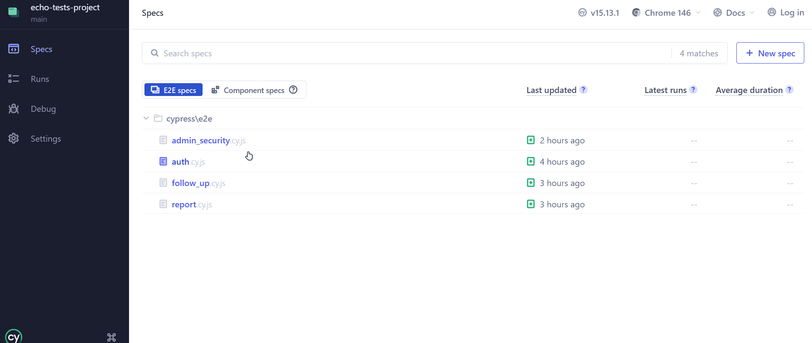

# 🧪 ECHO - Quality & Automation Hub

Este repositório é o centro estratégico de Garantia de Qualidade (QA) da plataforma **ECHO** (Ouvidoria Anônima). Aqui, aplicamos a **Pirâmide de Testes** para assegurar que a aplicação seja resiliente, segura e funcional, focando na proteção de dados sensíveis e na experiência do usuário.


## Arquitetura da Solução e Decisões de Engenharia
Optamos por uma estrutura de testes desacoplada para refletir cenários reais de produção em microsserviços:

* **Backend Integration (`echo-api`):** Testes focados em persistência, regras de negócio e segurança (RBAC). Hospedado no repositório [ECHO API](https://github.com/fernando-rgomes/echo-api.git).
* **Frontend Legacy (`echo-core`):** Interface original construída em Thymeleaf, utilizada como "MVP de validação" para a nova API. É o alvo principal dos testes automatizados de interface. Hospedado no repositório [ECHO Core](https://github.com/fernando-rgomes/echo-core.git).
* **QA & E2E Hub (Este Repositório):** Central de qualidade que consome o frontend para garantir a jornada do usuário de ponta a ponta.

> **Trade-off:** Optou-se por manter o frontend legado em vez de realizar uma migração para frameworks modernos (como React). Essa decisão nos permitiu focar os esforços na **robustez da nova API** e realizar um teste de regressão real: provando que a troca do "motor" do sistema manteve a interface funcional e livre de quebras de contrato.

---

## 🛡️ Showcase de Automação (Segurança & RBAC)
Para o projeto ECHO, a segurança é inegociável. Abaixo, demonstramos a automação validando o acesso exclusivo do perfil `ADMIN` às rotas gerenciais, impedindo o acesso não autorizado de usuários comuns.



---

## 🛠️ Tecnologias Utilizadas

### **Testes de Interface (E2E - Frontend)**
* **Cypress:** Framework principal para automação de navegadores e fluxos visuais.
* **JavaScript:** Linguagem base para os scripts de teste.

### **Testes de Integração (API - Backend)**
* **JUnit 5 & Rest Assured:** Validação de contratos, endpoints e *status codes*.
* **AssertJ:** Asserções fluentes para maior clareza e manutenção do código de teste.

---

## 📋 Documentação Técnica
Nossa metodologia não se resume apenas a código. O padrão de qualidade está documentado de ponta a ponta:

| Documento | Descrição |
| :--- | :--- |
| [**Plano de Testes**](./docs/TEST-PLAN.md) | Estratégia global, definição de pronto (DoD) e mitigação de riscos. |
| [**Casos de Teste**](./docs/TEST-CASES.md) | Matriz completa de cenários (API e E2E) e rastreabilidade. |
| [**Relatório de Defeitos**](./docs/BUG-REPORTS.md) | Histórico de bugs encontrados no ciclo de desenvolvimento e devidamente tratados. |

---

## ⚙️ Como Executar os Testes

A execução dos testes é independente para cada camada da aplicação. Siga as instruções abaixo de acordo com a suíte que deseja validar:

### **1. Testes de Interface (Cypress - E2E)**
Os testes automatizados de interface validam o frontend legado.

**⚠️ Pré-requisito:** Certifique-se de que o projeto **`echo-core`** esteja em execução localmente na **porta 8187**. Não é necessário iniciar a nova API para esta suíte.

No terminal deste repositório (`echo-teste-project`), execute:
```bash
# 1. Instale as dependências do projeto de QA
npm install

# 2. Para abrir a interface visual interativa do Cypress:
npx cypress open

# OU, para rodar todos os testes ocultos (direto no terminal):
npx cypress run
### 2. Testes de API (Backend)
Para validar os contratos e a segurança na fonte, navegue até a raiz do repositório da API (`echo-api`) e execute:

```bash
# Executa a suíte ignorando testes de contexto desnecessários
.\mvnw clean test -Dtest="!EchoApiApplicationTests" -DforkCount=0
```
### **2. Testes de API (Rest Assured - Backend)**
A suíte de integração do backend levanta seu próprio contexto de testes na memória, não dependendo da interface visual.

**🖥️ Exploração e Execução via IDE (Recomendado para Avaliação):**
A forma mais simples e visual de analisar a lógica (BDD) e rodar os testes é diretamente pelo **IntelliJ IDEA** (ou sua IDE de preferência):

1. Abra o projeto **`echo-api`** na sua IDE.
2. Navegue até a pasta de testes: `src/test/java/br/ufpb/dcx/echoapi/` (ou no pacote correspondente onde os testes estão organizados).
3. Abra qualquer classe de teste para ler a documentação viva e os cenários desenvolvidos.
4. Para executar, basta clicar no **botão de Play (seta verde)** na lateral esquerda (gutter) do editor:
   * Clique ao lado do nome da classe para rodar a suíte inteira daquele contexto.
   * Clique ao lado de um método específico (ex: `@Test void deveBloquearAcessoSemToken()`) para rodar apenas aquele cenário de forma isolada.

**⌨️ Execução via Terminal (Opcional):**
Caso prefira rodar todos os testes da aplicação de uma só vez pelo terminal, navegue até a raiz do repositório `echo-api` e execute:
```bash
.\mvnw clean test -Dtest="!EchoApiApplicationTests" -DforkCount=0
```

> 📄 **Evidência:** Você pode conferir os resultados de sucesso da execução da nossa suíte de integração e bloqueios de segurança aqui .

---

## 💎 Snippets em Destaque

Nossa automação vai além de cliques simples. Abaixo, exemplos de como resolvemos desafios técnicos de negócio:

### 1. Captura Dinâmica de Protocolo (E2E)
Em vez de depender de dados estáticos, o Cypress extrai o protocolo gerado dinamicamente pelo backend para validar a rota de acompanhamento de denúncias:
```bash
cy.get('.success-container').within(() => {
  cy.contains('Protocolo').parent().find('span').invoke('text').then(protocolo => {
    cy.log('Protocolo capturado: ' + protocolo.trim());
    cy.get('#protocolo-input').type(protocolo.trim());
  });
});
```
### 2. Blindagem de Rota Administrativa (E2E)
Garantindo que rotas restritas respondam com 403 Forbidden para usuários sem o nível de permissão adequado:
```bash
it('RBAC-03: Bloqueio de acesso forçado à rota Admin', () => {
  cy.login('comum@teste.com', 'senha123'); // Loga como ROLE_USER
  cy.visit('/admin/usuarios', { failOnStatusCode: false });
  cy.get('.error-title').should('contain', '403');
});
```
### 3. Testes de API Orientados a Comportamento (BDD)
No backend, estruturamos os testes de integração utilizando o padrão **Given-When-Then** (com Rest Assured). Isso transforma nossos testes em uma documentação viva e legível, facilitando o entendimento das regras de negócio por qualquer membro da equipe:

```java
@Test
@DisplayName("Deve bloquear o acesso às denúncias sem um token JWT válido")
void deveBloquearAcessoSemToken() {
    given()
        .header("Content-Type", "application/json")
    .when()
        .get("/api/admin/denuncias")
    .then()
        .statusCode(HttpStatus.FORBIDDEN.value());
}

