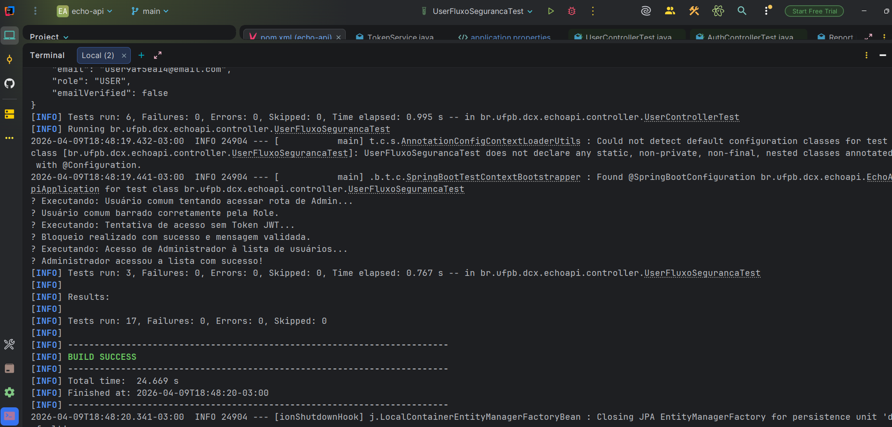

# 📋 Plano de Testes - Projeto ECHO

Este documento serve como o guia mestre de qualidade para a plataforma **Echo (Ouvidoria Anônima)**, detalhando as estratégias, ferramentas e heurísticas utilizadas para garantir um software seguro e resiliente.

---
###  Repositórios do Projeto
Para consultar a implementação dos testes e o código-fonte da aplicação, acesse os links abaixo:

* ⚙️ **Repositório Backend (API Spring Boot & Testes de Integração):** [Clique aqui para acessar o GitHub](https://github.com/fernando-rgomes/echo-api.git)
* 💻 **Repositório Base):** [Clique aqui para acessar o GitHub](https://github.com/fernando-rgomes/echo-core.git)

---

### 🎯 1. Objetivo e Política de Qualidade
Garantir a integridade, o anonimato e a segurança do sistema através de uma abordagem de **Pirâmide de Testes**. O foco principal é a proteção de dados sensíveis e a garantia de que as regras de negócio (RBAC) sejam invioláveis, tanto na camada de serviço (API) quanto na jornada do usuário (Web).

## 🧠 2. Escopo e Matriz de Rastreabilidade
Para garantir que nenhum requisito fique sem cobertura, utilizamos prefixos de identificação que conectam o código ao plano:

* **`USER-XXX`**: Cadastro e Integridade de Usuário (API).
* **`AUTH-XXX`**: Segurança, JWT e Autenticação (API).
* **`RBAC-XXX`**: Controle de Acesso Baseado em Perfis (API).
* **`REPORT-XXX`**: Ciclo de vida da denúncia e persistência (API).
* **`E2E-XXX`**: Jornada visual e comportamento funcional no navegador (Cypress).

## 🛠️ 3. Estratégia de Testes

### 🔸 Camada de Integração (API Backend)
* **Ferramentas:** JUnit 5, Rest Assured, AssertJ.
* **Foco:** Contratos JSON, Lógica de Negócio, Status Codes e Segurança.
* **Técnica:** Testes de estado e comportamento, garantindo que a API responda corretamente a entradas válidas e trate exceções de forma segura (sem vazar stacktraces).

### 🛡️ Evidência de Testes de Integração (Backend)
Abaixo, o log de execução da suíte de segurança, validando o bloqueio de acessos não autorizados e a integridade do RBAC (Role-Based Access Control).



> **Nota:** Todos os 17 cenários de integração foram validados com 100% de sucesso, cobrindo fluxos de Autenticação, Cadastro e Gestão de Denúncias.

### 🔸 Camada End-to-End (Web Frontend)
* **Ferramentas:** Cypress.
* **Foco:** Usabilidade, navegação entre rotas, feedback visual (alertas/toasts) e persistência visual dos dados.
* **Diferencial:** Automação de fluxos complexos, como a captura dinâmica de protocolos para consulta de status.

---

## 🚀 4. Execução dos Testes (Guia do Avaliador)

Para reproduzir os resultados de qualidade, utilize os comandos abaixo:

### **Backend (API)**
```bash
# Executa todos os testes de integração e gera relatório de cobertura
./mvnw test

# Abre a interface do Cypress para execução assistida
npx cypress open

# Executa os testes em modo headless (terminal)
npx cypress run
```
## ✅ 5. Critérios de Aceitação (Definition of Done)
Um caso de teste só é considerado concluído quando:
1. O código do teste segue os padrões de *Clean Code* e está documentado.
2. O teste passa de forma consistente em ambiente local (sem *flakiness*).
3. Qualquer bug identificado durante o teste foi registrado no [Relatório de Defeitos](./BUG-REPORTS.md).
4. A cobertura de código atende aos requisitos mínimos de segurança e negócio.

## ⚠️ 6. Riscos, Mitigações e Lições Aprendidas

| Risco Identificado | Ação Mitigadora Implementada |
| :--- | :--- |
| **Bypass de Segurança (RBAC)** | Implementação de testes negativos específicos para cada Role (`ADMIN` vs `USER`). |
| **Mascaramento de Erros** | Padronização do `GlobalExceptionHandler` para retornar erros granulares (400 vs 403). |
| **Sincronia em Testes E2E** | Uso de *Aliases* e *Promises* no Cypress para lidar com a natureza assíncrona da Web. |
| **Exceções de JS no Front** | Implementação de *Guard Clauses* no JavaScript para evitar quebra de scripts em páginas dinâmicas. |

## 📊 7. Documentação de Suporte
* [**Casos de Teste Detalhados**](./TEST-CASES.md): Lista completa de cenários e resultados esperados.
* [**Relatório de Defeitos**](./BUG-REPORTS.md): Histórico de bugs encontrados e corrigidos.
